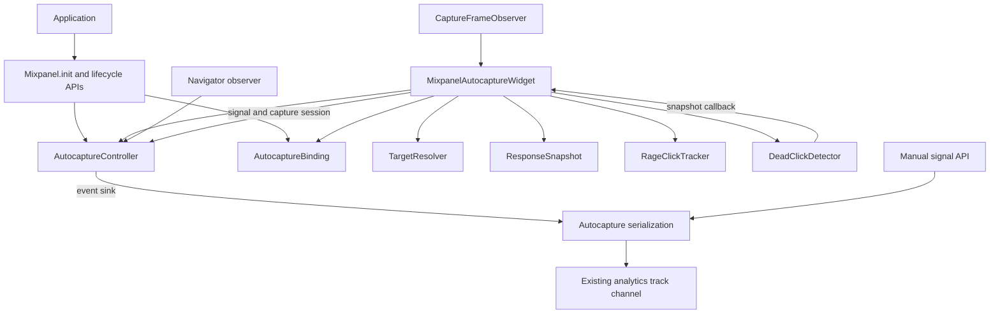

# Flutter frustration signals: implementation architecture

Status: discussion document, updated 2026-09-23. Describes PR [#286](https://github.com/mixpanel/mixpanel-flutter/pull/286) at baseline commit `8dc2233`, with the non-architectural configuration and test updates described below.

This document explains the implementation that exists today. The final section separates completed non-architectural follow-ups from architectural changes still proposed for discussion with Tyler. It does not claim release readiness or replace device and performance validation.

## Purpose and scope

The analytics SDK can observe Flutter pointer interactions and emit `$mp_click`, `$mp_rage_click`, and `$mp_dead_click`. Detection runs in Dart against Flutter widgets and render objects. Events use the existing analytics transport; this feature does not introduce a native autocapture pipeline, another plugin, or a dependency on Session Replay.

Automatic capture is opt-in and currently runs only on Android and iOS. Manual signal APIs are separate: the application supplies metadata and determines that the signal occurred. A manual click does not start automatic rage or dead detection.

The implementation ships inside `mixpanel_flutter`, with Flutter >=3.19.0 and Dart >=3.3.0. The direct use of `SemanticsProperties.identifier` drove the Flutter floor. This is a package-wide compatibility change, including applications that leave autocapture disabled. Older applications must upgrade Flutter or stay on an earlier analytics release. We chose one package to avoid introducing publishing/setup work now; this is a deliberate tradeoff, not evidence that all customers have upgraded. See [the packaging decision](SDK30_PACKAGE_BOUNDARY.md) for possible extraction before release.

Behavior decisions are recorded in [AUTOCAPTURE.md](../context/AUTOCAPTURE.md). In particular, Android supplies the agreed rage-reset and dead-candidate replacement rules. The Flutter implementation does not call Android's detectors.

## Application integration

An application supplies `AutocaptureOptions` to `Mixpanel.init`, places `MixpanelAutocaptureWidget` above its app and navigators, and registers a separate `MixpanelAutocaptureNavigatorObserver` with each relevant navigator. The wrapper accepts a nullable SDK instance so initialization can complete without remounting the application child.

`ClickOptions`, `RageClickOptions`, and `DeadClickOptions` independently control emission/detection. All three default to enabled when `AutocaptureOptions` is supplied; omitting the options disables automatic capture. Disabling ordinary click emission does not disable rage/dead recognition.

Current defaults are four taps within a rolling 1000 ms window and 44 logical pixels for rage, and a 500 ms response deadline for dead clicks. The reviewed baseline used integer milliseconds and bounded getters. The 2026-09-23 follow-up exposes final `Duration timeWindow` fields. Threshold/radius assertions run at construction; duration assertions run when consumed to preserve const constructors. Internal normalization retains release-mode bounds.

## Components and dependencies

Source links below are relative to this document.

| Component | Current responsibility | Dependencies and retained state |
| --- | --- | --- |
| [Mixpanel / Autocapture](../packages/mixpanel_flutter/lib/mixpanel_flutter.dart) | Initialize the capture adapter, coordinate consent/identity lifecycle, expose manual APIs, serialize events into the existing `track` channel | Active controller, initialization generation; existing analytics/native transport |
| [AutocaptureBinding](../packages/mixpanel_flutter/lib/src/autocapture/autocapture_binding.dart) | Associate an SDK instance with its internal controller | Static `Expando` with weak instance keys |
| [AutocaptureController](../packages/mixpanel_flutter/lib/src/autocapture/autocapture_controller.dart) | Gate automatic delivery, invalidate pending work, arbitrate view ownership | Options, event-sink callback, explicit capture status, consent request, capture session, view-owner map; no MethodChannel or widget-tree inspection |
| [MixpanelAutocaptureWidget / _CaptureState](../packages/mixpanel_flutter/lib/src/autocapture/autocapture_widget.dart) | Attach observation, recognize pointer taps, coordinate targets and responses, dispatch signals | Controller, detectors, active pointers, one pending-tap object, subscriptions |
| MixpanelAutocaptureNavigatorObserver | Cancel pending detection on push/pop/remove/replace without collecting route metadata | SDK instance and internal controller lookup |
| [TargetResolver](../packages/mixpanel_flutter/lib/src/autocapture/target_resolver.dart) | Map a hit-tested pointer to a public widget owner and privacy-constrained event metadata | Flutter element/render trees; bounded traversal |
| [ResponseSnapshot](../packages/mixpanel_flutter/lib/src/autocapture/response_snapshot.dart) | Summarize observable meaningful UI state for comparison | Ephemeral hash; transform cache exists only during each capture |
| [RageClickTracker](../packages/mixpanel_flutter/lib/src/autocapture/rage_click_tracker.dart) | Count nearby recent accepted taps | Coordinates and pointer timestamps, bounded history; no tree or transport |
| [DeadClickDetector](../packages/mixpanel_flutter/lib/src/autocapture/dead_click_detector.dart) | Time one candidate, cancel on changed/unknown response, emit when unchanged | One pending candidate containing baseline, event, timer and validity/delivery callbacks |
| CaptureFrameObserver | Dispatch produced-frame sampling only to active observers | Binding installation registry and removable callback registrations |
| [ClickEvent](../packages/mixpanel_flutter/lib/src/autocapture/click_event.dart) | Carry event metadata across the detector/analytics boundary | Coordinates and string metadata; no element/render references or response digest |

The dead detector requests snapshots through an injected callback. Snapshot capture
no longer reads detector state: each candidate owns its validity predicate and
delivery callback, keeping target lifetime separate from view observation.

## SDK/widget association and ownership

The widget receives the same `Mixpanel` instance the application uses for analytics. It does not create a second instance. Initialization creates a controller, attaches it to that instance in `AutocaptureBinding`, and injects an event sink that invokes the existing autocapture serializer.

The binding exists because separate Dart libraries cannot access each other's private members. Keeping a private controller field in `mixpanel_flutter.dart` would not make it accessible to `autocapture_widget.dart`. An earlier public controller getter exposed implementation state; the internal binding replaced it. `Expando` keys avoid a strong static map retaining discarded SDK instances. This bridge is not exported from the public entry point, though Dart `lib/src` conventions are not an absolute access-control boundary.

This has costs: association is implicit, lookup is static, and it is less obvious than a constructor dependency. Alternatives include a deliberately exposed adapter contract or sharing library-private state through `part` files. Neither alternative has been adopted; `part` coupling would also affect future extraction.

Two ownership rules are distinct:

- Analytics maintains one active automatic controller because native channel state is shared. Reinitialization closes the previous controller before awaiting native initialization. An initialization generation prevents an older completion from becoming the active capture instance. This does not serialize native initialization calls themselves.
- Within a controller, one widget can claim each Flutter `viewId`. A duplicate/nested wrapper cannot emit duplicate signals for that view. Claims are released on detach. This is a duplicate-observation guard, not a general automatic ownership-transfer system.

Lifecycle operations through an older Dart SDK handle still suspend the active controller. Otherwise a call that changes shared native identity or consent could leave another handle's automatic capture running with stale assumptions.

## Consent and cancellation state

The controller uses one explicit authorization state and two named operations:

| Value | Meaning | Cancellation boundary |
| --- | --- | --- |
| `CaptureStatus` | Suspended, enabled, or permanently closed | Unknown/failed consent remains suspended; closed cannot be reopened |
| `ConsentRequest` | One native lifecycle operation or asynchronous consent read | Replaced/cancelled by newer consent operations, opt-out, or close; unaffected by navigation |
| `CaptureSession` | Shared validity of pending detections | Cancelled by navigation, suspension, or close; old signals cannot emit into a newer session |

`invalidate()` cancels the current capture session, creates a replacement and
notifies widgets to clear pending detection. `suspend()` also changes status and
replaces the consent request. The request returned before a native lifecycle call
must still be current when that call completes. `refreshConsent()` consumes that
request once, replacing it with a read request; only the current read can enable
capture, and only when native consent explicitly reports opted-out as false.
Completed requests cannot be reused. Identity checks also reject requests/sessions
from another controller.

| Trigger | Current behavior |
| --- | --- |
| Initialization | Close old controller; attach new controller if options are enabled; resolve consent before observation |
| Opt-out | Suspend immediately, then invoke native opt-out; a native failure does not resume capture |
| Opt-in | Suspend immediately; refresh consent after native success; remain suspended on failure |
| Identify/reset | Suspend before native call; refresh consent in `finally`, including on failure; preserve the native exception for the caller |
| Navigation | Invalidate detections without changing consent status/request |
| App backgrounding | Widget clears pending work and blocks input while not resumed; no new consent read is implied |
| Focus, scroll, metrics response | Cancel response baselines/dead candidates; do not treat this as a consent transition |
| Widget detach/dispose | Clear work, unsubscribe, and release view ownership |

For example, opt-out cancels a pending identify recovery request, so its eventual
result is ignored. Navigation cancels only the capture session, allowing the
consent read to finish. Closing the controller cancels both and sets terminal
status before notifying listeners.

The controller checks authorization and the signal's active capture session
again when emitting. It invokes the sink immediately rather than adding another
deferred queue before analytics. Actual delivery remains the responsibility of
existing analytics transport.

## From pointer input to signals

1. On pointer down, the widget checks platform, foreground state, consent, view ownership and view ID. It accepts touch or mouse with the primary button. Multiple pointers invalidate the press.
2. The resolver selects the target. The widget records position, timestamp, capture session and Flutter's device-appropriate hit slop in one `_PendingTap` object. For an eligible dead-click target it captures a response baseline before ordinary tap handlers run.
3. Moves beyond slop invalidate tap acceptance even if the pointer returns. Pointer cancellation clears the press. Produced frames can invalidate the response baseline before pointer up, preserving transient responses.
4. Pointer up requires a single tracked pointer, a mounted target, nonnegative duration at most 500 ms inclusive, no excessive movement, and a still-current capture context.
5. Every accepted tap cancels the previous dead candidate before checking the new target's dead eligibility. Click and rage processing run independently of dead eligibility.
6. A new dead candidate is armed only with an eligible target and a known, still-valid baseline. Its response deadline begins when armed after pointer up.

This observes pointer taps; it does not participate in Flutter's gesture arena to prove that an application callback executed. Keyboard/assistive activation is outside the automatic scope. Custom raw pointer handlers may run before baseline capture, so their response coverage is not guaranteed.

Rage detection uses distance from the current tap, not a shared element ID or a chain of pairwise-nearby taps. Window/radius equality counts. On threshold, history clears; backwards timestamps and a 512-record cap also clear history. This keeps storage bounded and avoids reusing uncertain sequences.

## Target attribution and privacy boundary

The resolver hit-tests the owning view and maps render hits back to elements. Its fast traversal prunes by render ancestry, but it must find the deepest render hit's owner. If it cannot, a separately budgeted unpruned pass handles cases such as `OverlayPortal`, whose element and render ancestry differ. It does not substitute a convenient ancestor/root for an unresolved hit.

It selects the nearest actionable owner, promoting framework-internal gesture/ink handling to its public button while preserving separately actionable nested children. Without an actionable owner, it uses a supported content widget or the hit leaf for click/rage metadata.

Identifiers come from a valid `Semantics.identifier` at or above the selected owner, examining at most 11 elements including the owner and stopping at another actionable ancestor. Descendant IDs do not name their containing button. Blank or over-256-character IDs are ignored. Otherwise the resolver generates a structural FNV-based ID from canonical widget types and sibling positions. Structural IDs are not promised to survive tree restructuring.

Automatic metadata never uses accessibility labels, displayed text, editable values, widget key values, debug creators or runtime type strings. Explicit developer identifiers are trusted strings, not a PII sanitization mechanism: applications must use static, non-sensitive values. The short hierarchy is limited to canonical widget types.

Traversals are bounded to 2,000 elements and depth 512; failure suppresses the affected detection. Metadata extraction and response comparison are different boundaries: displayed non-editable text can contribute to a private response digest, but that text and digest never enter `ClickEvent` or analytics payloads.

## UI response and dead-click detection

A dead click means an eligible interaction had no observed meaningful response before its deadline. It is not proof that the application performed no work.

`ResponseSnapshot.capture` computes a short-lived digest of supported meaningful widget properties and geometry across the wrapper's observed subtree in the owning view. Wrapping above the app and navigators is important: responses outside the wrapper's subtree are not observed. The implementation compares text changes, selected control state, image identity, colors, decorations and geometry, while excluding ordinary ink/ripple and framework paint machinery.

Geometry uses actual render-parent transforms, cached for one capture, in logical viewport coordinates. An element subtree is not discarded just because its host render box is offscreen or zero-sized: descendants can render elsewhere through portals.

Visible or uncertain platform views, textures and unsupported custom painters make response coverage unknown. Proven offscreen surfaces do not veto the whole check, but descendants are still visited. Editable/secure content is not read. Feedback controls such as text fields, switches and sliders are excluded as dead-click targets; selected supported control state can still indicate a response elsewhere.

There are three conceptual comparison outcomes, although the current API represents them using a nullable snapshot:

| Observation | Representation today | Effect |
| --- | --- | --- |
| Known unchanged | Non-null snapshot matching baseline | Keep waiting; emit at deadline if all other guards hold |
| Known changed | Non-null snapshot differing from baseline | Cancel candidate permanently |
| Unknown | Null snapshot, including unsupported coverage, failure or exhausted budget | Suppress/cancel; never infer a dead click |

Only one dead candidate exists per widget. `_PendingDeadClick` groups its baseline,
event, timer and callbacks. Cancelling drops that object; timer and deferred-frame
callbacks check object identity so a cancelled candidate cannot finish a replacement.
At the deadline the detector samples again, deferring until after rendering when a
frame is already scheduled. A response after emission does not retract an event.

The candidate's validity callback captures a weak target reference and capture
session; its delivery callback carries that same session to the controller. The
widget no longer stores separate pending-dead target/session fields. `_snapshot()`
only observes the current view and does not inspect detector state. When an old
target is detached, that candidate is invalidated independently of a new press's
response baseline.

`CaptureFrameObserver` installs one persistent callback per binding and retains removable widget listeners. It does not schedule frames. While idle it checks whether anyone is observing, but does not allocate the listener copy or queue sampling callbacks. While a prior dead candidate and a new press overlap, the widget shares one frame snapshot between them. Once a change is observed, returning to the original UI does not restore the cancelled baseline.

## Event delivery and failure handling

Automatic signals pass through the controller gate, then the same serializer used by manual APIs. Coordinates must be finite and IDs nonblank; coordinates become integer values. Typed metadata overrides caller properties, and absent optional typed metadata removes conflicting caller-supplied keys. `$mp_autocapture` is set by the serializer.

Manual calls bypass the automatic controller/detectors and use the existing native analytics consent behavior. They should not be described as receiving the automatic controller's permission checks.

Resolver/snapshot failures return no target or unknown coverage. Event transport failures are contained with generic diagnostics rather than payload-bearing exception details. Existing lifecycle methods such as identify/reset can still propagate native errors; the capture integration must not hide those errors or remain stuck solely because their native operation failed.

## Testing and known limits

The current suite has direct controller, rage-tracker, frame-observer and manual-serialization tests, plus broad widget/channel integration tests and lifecycle-failure tests. Existing integration cases exercise privacy, portals, transient responses, feedback controls, unsupported surfaces and positive dead-click emission. Historical validation records report 239 analytics tests passing on Flutter 3.19.0 and 3.44.6 before the follow-up component tests. See the behavior context for updated validation results.

At the reviewed baseline, direct tests of `TargetResolver`, `ResponseSnapshot` and `DeadClickDetector` were missing. The 2026-09-23 follow-up adds dedicated tests for those components without changing widget architecture. Their integration coverage is useful but makes failures harder to localize and can leave individual negative cases passing without proving that a candidate armed. A globally nonfunctional dead detector would fail existing positive tests; that does not eliminate the need for focused coverage.

Target/snapshot tests still require Flutter trees and a test binding, but need not initialize Mixpanel or inspect serialized channel events. Traversal limits bound work; they are not performance measurements. Device behavior, profile-mode costs, unsupported/custom rendering coverage and future platform support still require validation. Web/macOS automatic capture is gated off; shared Dart logic does not establish readiness on those platforms.

## Follow-up status and proposed discussion with Tyler

1. **Agree on the state and ownership model.** Keep consent authorization separate from detection cancellation; review the explicit status and request/session objects and decide whether the implicit binding is an acceptable internal bridge.
2. **Add focused tests before broad restructuring (initial coverage implemented).** Exercise resolver ID precedence/privacy/budgets/portal ownership; snapshot geometry, meaningful changes and unknown coverage; detector deadlines, cancellation generations and post-frame deferral directly. Retain integration tests for wiring and lifecycle behavior.
3. **Extract pointer recognition.** A `TapRecognizer` could own pointer count, button/kind acceptance, movement and duration, returning an accepted/rejected interaction. Keep target mounting, view ownership and capture-session validity in orchestration rather than introducing SDK dependencies into the recognizer.
4. **Separate response tracking from orchestration.** A `UiResponseTracker` could own response baselines, focus/scroll/metrics inputs and frame sampling, returning explicit changed/unchanged/unknown outcomes. Decide whether candidate target lifetime belongs in the detector or an injected validity callback. Preserve overlapping-press shared sampling and transient-response cancellation.
5. **Use Dart-native public configuration (implemented in the non-architectural follow-up).** Use `Duration` for time windows and final fields with debug assertions. Preserve a deliberate release-mode policy for invalid inputs; assertions alone do not replace today's normalization. Session Replay itself documents runtime resolution for its flush interval, so public assertions and internal normalization need not conflict.
6. **Confirm compatibility and release scope.** Review the package-wide minimum Flutter impact, Beta documentation and remaining validation separately from architectural cleanup. Optional package extraction remains possible but requires explicit lifecycle integration and public API/release setup changes, not merely moving files.

The recommended first step is agreement on this description and the desired boundaries. The non-architectural follow-up adds configuration updates and focused tests; widget decomposition remains proposed. Preserve the agreed signal behavior through that decomposition.

## State-model follow-up

The explicit consent status, consent requests, capture sessions, grouped pending
press and grouped dead candidate are implemented. Full `TapRecognizer` and
`UiResponseTracker` extraction remains future work; this change simplifies state
ownership without introducing a state-machine framework or changing the public API.
