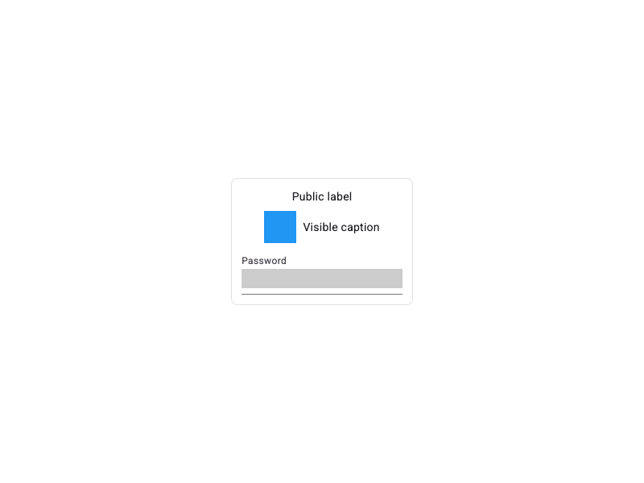
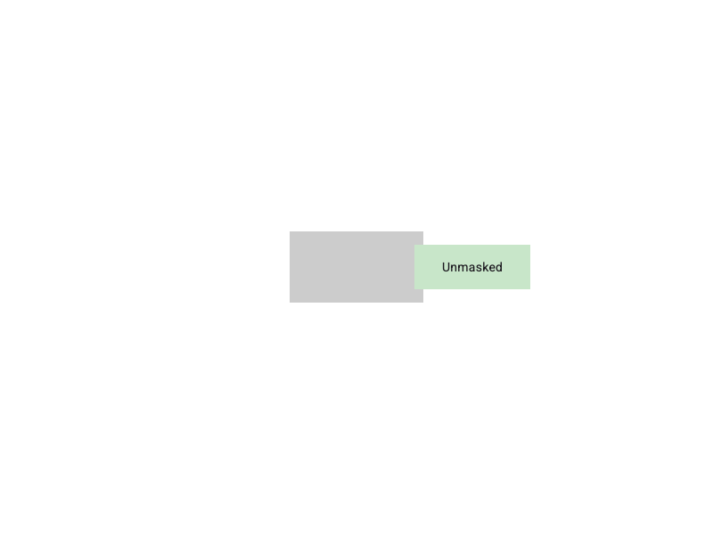
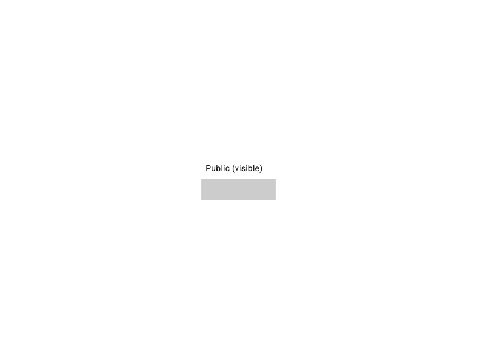
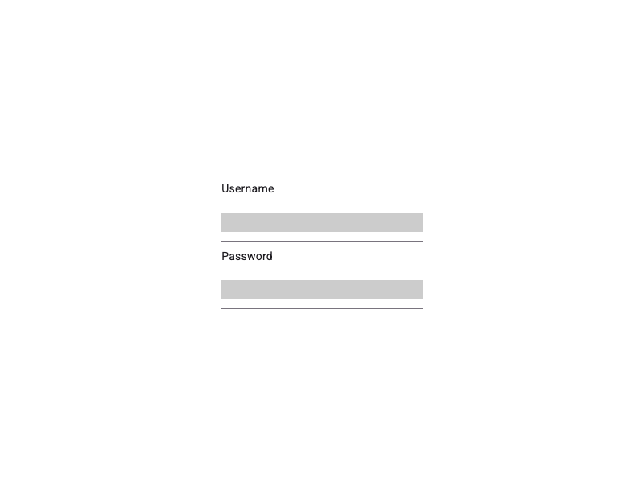
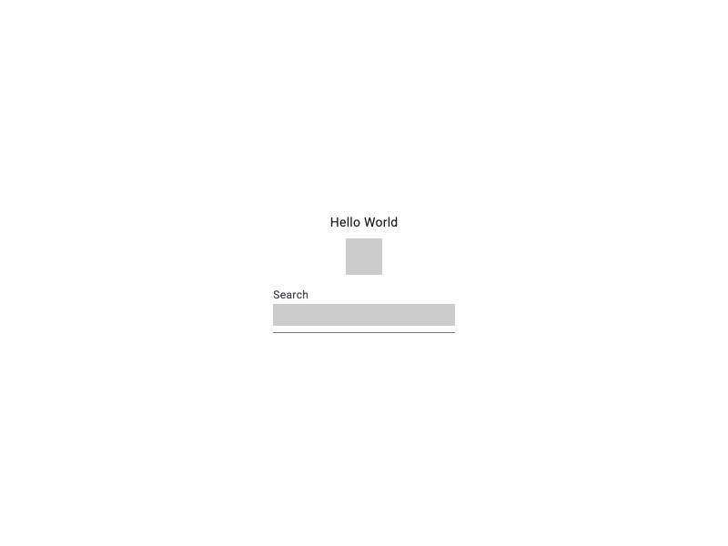

# Mixpanel Flutter Session Replay

##### _June 22, 2026_ - [session-replay-v1.0.0](https://github.com/mixpanel/mixpanel-flutter/releases/tag/session-replay-v1.0.0)

## Overview

This developer guide will assist you in configuring your Flutter app for [Mixpanel Session Replay](https://docs.mixpanel.com/docs/session-replay). Learn more about viewing captured Replays in your project [here](https://docs.mixpanel.com/docs/session-replay).

## Best practices

Session Replay provides powerful insights into user behavior, but it also introduces risks, especially on mobile. These risks are not unique to Mixpanel; they are common across the entire session replay product category. Because SDKs run on end-user devices and screen content may include sensitive data, we recommend implementing / testing Session Replay carefully. Be especially cautious with masking, edge-case testing, and rollout strategies. For more information on risk categories and best practices, read more [here](https://docs.mixpanel.com/docs/session-replay#best-practices).

## Prerequisites

* You are already a Mixpanel customer.
* [Optional] We recommend having the latest [Mixpanel Flutter SDK](https://github.com/mixpanel/mixpanel-flutter) installed. Instructions can be found [here](https://docs.mixpanel.com/docs/quickstart/install-mixpanel). The Mixpanel Flutter SDK provides a `distinctId` (via `mixpanel.distinctId`) that you can pass to Session Replay during initialization to associate replays with your Mixpanel analytics identity.

| Platform | Minimum Version |
|----------|----------------|
| Flutter  | 3.38+          |
| Dart     | 3.8+           |
| iOS      | 13.0+          |
| Android  | API 24 (7.0+)  |
| macOS    | 10.15+         |

## Installation

Add to your `pubspec.yaml`:

```yaml
dependencies:
  mixpanel_flutter_session_replay: 1.0.0
```

## Initialize

Session Replay requires initializing an instance and wrapping your app with `MixpanelSessionReplayWidget`. The SDK does not use a singleton — store the instance using State, Provider, or whichever state management fits your app.

Pass the instance to `MixpanelSessionReplayWidget` to begin capturing. Initialize asynchronously to avoid delaying your app's first frame — the widget handles transitioning from a `null` instance to an initialized one.

```dart
import 'package:mixpanel_flutter_session_replay/mixpanel_flutter_session_replay.dart';

class _MyAppState extends State<MyApp> {
  MixpanelSessionReplay? _sessionReplay;

  @override
  void initState() {
    super.initState();
    _initSessionReplay();
  }

  Future<void> _initSessionReplay() async {
    final result = await MixpanelSessionReplay.initialize(
      token: 'YOUR_MIXPANEL_TOKEN',
      distinctId: 'user_123', // or mixpanel.distinctId
      options: SessionReplayOptions(
        autoRecordSessionsPercent: 100.0,
      ),
    );
    if (result.success) {
      setState(() => _sessionReplay = result.instance);
    } else {
      debugPrint('Session Replay init failed: ${result.errorMessage}');
    }
  }

  @override
  Widget build(BuildContext context) {
    return MixpanelSessionReplayWidget(
      instance: _sessionReplay, // null until initialization completes
      child: MaterialApp(home: HomeScreen()),
    );
  }
}
```

## Quick start

Here's a quick overview of some available controls. For a more in-depth guide, continue reading.

```dart
// start recording manually (with optional sampling rate)
sessionReplay.startRecording(sessionsPercent: 100.0);

// stop recording
sessionReplay.stopRecording();

// update user identity
sessionReplay.identify('new_distinct_id');

// mask a sensitive widget
MixpanelMask(child: Text('Sensitive text'))

// unmask a safe widget
MixpanelUnmask(child: Text('Public text'))

// flush queued events
await sessionReplay.flush();
```

See [Masking behavior](#masking-behavior) for detailed examples of how `MixpanelMask`, `MixpanelUnmask`, and auto-masking interact.

## Capturing replays

> [!WARNING]
> Test in a sandbox project and start with a 100% sample rate. This allows you to monitor performance, usage, and ensure your privacy rules align with your company policies.

By default, recording begins automatically upon initialization, configurable via the `autoRecordSessionsPercent` option.

### Sampling

We recommend using automatic sampling for most use cases. Use [manual capture](#manual-capture) if you need control over exactly when recording starts and stops.

To enable Session Replay, set `autoRecordSessionsPercent` between 0.0 and 100.0. At 0.0, no sessions are recorded. At 100.0, all sessions are recorded.

To start, we recommend using a 100% sampling rate to ensure replay capture is behaving as expected, then adjust according to your specific analytics needs.

```dart
// records 100% of all sessions
options: SessionReplayOptions(
  autoRecordSessionsPercent: 100.0,
)
```

### Manual capture

To programmatically start and stop replay capture, use the `.startRecording()` and `.stopRecording()` methods.

**Start capturing replay**

When calling `.startRecording()`, recording will begin with the sample rate that was passed to `sessionsPercent` (100% default).

```dart
// start recording (100%)
sessionReplay.startRecording();

// start recording with a specified sampling rate (10%)
sessionReplay.startRecording(sessionsPercent: 10.0);
```

**Stop capturing replay data**

Call `.stopRecording()` to stop any active replay data collection. The SDK automatically stops recording when the app loses focus.

```dart
// manually end a replay capture
sessionReplay.stopRecording();
```

**Example use cases for manual capture**

| Scenario | Guidance |
|----------|----------|
| We have a sensitive screen we don't want to capture | When user is about to access the sensitive screen, call `.stopRecording()`. To resume recording once they leave this screen, you can resume recording with `.startRecording()` |
| We only want to record certain types of users (e.g. Free plan users only) | Using your application code, determine if current user meets the criteria of users you wish to capture. If they do, then call `.startRecording()` to begin recording |
| We only want to record users utilizing certain features | When user is about to access the feature you wish to capture replays for, call `.startRecording()` to begin recording |

## Additional configuration options

Upon initialization you can provide a `SessionReplayOptions` object to customize your replay capture.

| Option | Description | Default |
|--------|-------------|---------|
| `autoMaskedViews` | Set of enum options for view types that will be automatically masked by the SDK. See [Masking behavior](#masking-behavior) | `{text, image}` |
| `autoRecordSessionsPercent` | Value between 0.0 and 100.0 that controls the sampling rate for session replay recording | `100.0` |
| `flushInterval` | Specifies the flush interval at which session replay events are sent to the Mixpanel server | `10 seconds` |
| `logLevel` | Controls the level of debugging logs printed to the console | `LogLevel.none` |
| `storageQuotaMB` | Maximum MB for the local event queue | `50` |
| `debugOptions` | Debug configuration for mask overlay visualization. See [Debug options](#debug-options) | `null` (disabled) |
| `platformOptions` | Platform-specific options. See [Platform options](#platform-options-mobile-only) | `PlatformOptions()` |

**Example usage:**

```dart
final result = await MixpanelSessionReplay.initialize(
  token: 'YOUR_MIXPANEL_TOKEN',
  distinctId: 'user_123',
  options: SessionReplayOptions(
    autoRecordSessionsPercent: 100.0,
    autoMaskedViews: {AutoMaskedView.image, AutoMaskedView.text},
    logLevel: LogLevel.debug,
    flushInterval: Duration(seconds: 10),
    platformOptions: PlatformOptions(
      mobile: MobileOptions(wifiOnly: true),
    ),
  ),
);
```

#### Platform options (mobile only)

| Option | Description | Default |
|--------|-------------|---------|
| `mobile` | Mobile-specific options (iOS/Android). See properties below | `MobileOptions()` |
| `mobile.wifiOnly` | When `true`, replay events will only be flushed when the device has WiFi. When `false`, replay events will be flushed with any network connection including cellular | `true` |

#### Debug options

When non-null, enables debug features such as colored overlays showing masked, auto-masked, and unmasked regions.

| Option | Description | Default |
|--------|-------------|---------|
| `overlayColors` | Color configuration for mask overlay visualization. When null, overlay is disabled. See properties below | `DebugOverlayColors()` |
| `overlayColors.maskColor` | Color for manually masked regions (`MixpanelMask` and security-enforced) | `Colors.red` |
| `overlayColors.autoMaskColor` | Color for auto-masked regions (text and images) | `Colors.orange` |
| `overlayColors.unmaskColor` | Color for `MixpanelUnmask` regions | `Colors.green` |
| `overlayColors.opacity` | Opacity of the overlay layer (0.0 = transparent, 1.0 = opaque) | `0.5` |

```dart
options: SessionReplayOptions(
  debugOptions: DebugOptions(
    overlayColors: DebugOverlayColors(
      maskColor: Colors.red,       // MixpanelMask and security-enforced regions
      autoMaskColor: Colors.orange, // Auto-masked text and image regions
      unmaskColor: Colors.green,    // MixpanelUnmask regions
      opacity: 0.5,
    ),
  ),
)
```

## Identity management

The Mixpanel distinct ID for the current user can be passed into the initializer and changed at runtime by calling the `.identify()` method:

```dart
// initialize the main Mixpanel tracking SDK
final mixpanel = await Mixpanel.init('YOUR_MIXPANEL_TOKEN', trackAutomaticEvents: true);

// initialize the session replay SDK with the project token and distinct ID from above
final result = await MixpanelSessionReplay.initialize(
  token: 'YOUR_MIXPANEL_TOKEN',
  distinctId: mixpanel.distinctId,
);
```

To change the distinct ID later:

```dart
// for example when the user logs out
void logout() {
  // reset the main Mixpanel tracking SDK to generate a new distinct ID
  mixpanel.reset();
  final newDistinctId = mixpanel.distinctId;
  // change session replay distinct ID
  sessionReplay.identify(newDistinctId);
}
```

## Manual flushing

You can flush any currently queued session replay events at any time by calling `.flush()`:

```dart
await sessionReplay.flush();
```

## Logging

Developers can enable or disable logging with the `logLevel` option of the `SessionReplayOptions` object.

```dart
final result = await MixpanelSessionReplay.initialize(
  token: 'YOUR_MIXPANEL_TOKEN',
  distinctId: distinctId,
  options: SessionReplayOptions(
    logLevel: LogLevel.debug,
  ),
);
```

## Server-side stitching

Server-Side Stitching allows you to easily watch Replays for events that were not fired from the SDK.

It works by inferring the Replay that an event belongs to using the Distinct ID and time property attached to the event. This is especially useful if you have events coming in from multiple sources.

For example, let's say a user with Distinct ID "ABC" has a Replay recorded from 1-2pm. Two hours later, an event was sent from your warehouse with a timestamp of 1:35pm with Distinct ID "ABC". Server-Side Stitching will infer that the event should belong in the same Replay.

To ensure Server-Side Stitching works, call `identify()` from the client-side using our SDK with the user's `$user_id`. This guarantees that events generated from both the client-side and server-side share the same Distinct ID. Learn more about [identifying users](https://docs.mixpanel.com/docs/tracking-methods/id-management).


## Debugging

`$mp_session_record` is exempt from your plan data allowance.

To check your implementation, select **Session Replay** from the side navigation in your Mixpanel project to see whether replays are being captured and appearing as expected. When a capture begins, a "Session Recording Checkpoint" event (`$mp_session_record`) also appears in your project; you can use this to verify that Session Replay is implemented correctly.

If you are using the [recommended sampling method](#sampling) to capture your Replays but having trouble finding the Replays in your project, try calling `.startRecording()` manually and see if the `$mp_session_record` event appears. If it does appear but you are still struggling to locate your Replays, you may want to increase your sampling rate.

## Troubleshooting

If you are still struggling with either of the following common issues:

- Replays are not showing up in my project
- Replays are not displaying my UI correctly

Please [submit a request to our Support team](https://mixpanel.com/get-support) and include the following information:

- Whether your issue is with iOS, Android, macOS, or all platforms
- Your Session Replay code snippet
- Where you initialize the Session Replay SDK
- Any relevant logs (enable with `logLevel: LogLevel.debug`)
- (If applicable) A link to a replay showing the issue
- (If applicable) A screenshot of the UI or a description of the expected behavior

## Privacy

Mixpanel offers a privacy-first approach to Session Replay, including features such as data masking. Mixpanel's Session Replay privacy controls were designed to assist customers in protecting end user privacy. Read more [here](https://docs.mixpanel.com/docs/session-replay/session-replay-privacy-controls).

### User data

The Mixpanel SDK will always mask all detected text inputs. To protect end-user privacy, input text fields cannot be unmasked.

By default, we attempt to identify all text and image views.

You can unmask these elements at your own discretion using the [`autoMaskedViews` config option](#additional-configuration-options). See [Masking behavior](#masking-behavior) for detailed examples of how masking directives interact.

### Mark widget sensitivity

All text input widgets (TextField, TextFormField, CupertinoTextField) are masked by default. Text inputs cannot be unmasked.

Wrap any widget with `MixpanelMask` to force masking, or `MixpanelUnmask` to prevent auto-masking. These directives apply to the entire subtree.

```dart
Column(
  children: [
    // This entire card and its contents will be masked
    MixpanelMask(
      child: Card(
        child: Column(
          children: [
            Text('Account Number: 1234-5678'),
            Text('Balance: \$10,000'),
          ],
        ),
      ),
    ),

    // This section will not be auto-masked (except text inputs)
    MixpanelUnmask(
      child: Row(
        children: [
          Image.asset('logo.png'), // visible, even if images are auto-masked
          Text('Public info'),     // visible, even if text is auto-masked
          TextField(),             // still masked — text inputs are always masked
        ],
      ),
    ),
  ],
)
```

For detailed scenarios showing how masking directives interact (nesting, overflow, security), see [Masking behavior](#masking-behavior).

## Retention

By default, Mixpanel retains Session Replays for 30 days from the date the replay is ingested and becomes available for viewing within Mixpanel. Customers on our [Enterprise plan](https://mixpanel.com/pricing/) can customize this retention period between 7 days and 360 days. Once a replay is expired, there is no way to view that replay.

## FAQ

### How does Session Replay work in Flutter?

Session Replay observes user interactions within your app, capturing UI hierarchy changes and storing them as images, which are then sent to Mixpanel. Mixpanel reconstructs these images, applying recorded events as an end-user completes them.

Within Mixpanel's platform, you can view a reconstruction of your end-user's screen as they navigate your app.

However, Session Replay is not a literal video recording of your end-user's screen; end-user actions are not video-recorded.

### Can I prevent Session Replay from recording sensitive content?

The Mixpanel SDK will always mask identifiable text inputs. By default, all text and images on a page are also masked.

Additionally, you can customize how you leverage our SDK to fully control (1) where to record and (2) whom to record. Consider the [manual capture example scenarios](#manual-capture), [SDK configuration options](#additional-configuration-options), and [manual widget masking](#mark-widget-sensitivity) provided above to customize the replay capture of your implementation. See [Masking behavior](#masking-behavior) for detailed examples.

### How can I estimate how many Replays I will generate?

If you already use Mixpanel, the [Session Start events](https://docs.mixpanel.com/docs/features/sessions) are a way to estimate the rough amount of replays you might expect. This is especially true if you use timeout-based query sessions. However, because our sessions are defined at query time, we cannot guarantee these metrics will be directly correlated.

When you enable Session Replay, use the above proxy metric to determine a starting sampling percentage, which will determine how many replays will be sent. You can always adjust this as you go to calibrate to the right level.

### How does Session Replay affect my app's bandwidth consumption?

The bandwidth impact of Session Replay depends on the setting of the [`wifiOnly` parameter](#additional-configuration-options).

By default, `wifiOnly` is set to `true`, which means replay events are only flushed to the server when the device has a wifi connection. If there is no wifi, flushes are skipped, and the events remain in the local disk queue until WiFi is restored. This ensures no additional cellular data is used, preventing users from incurring additional data charges.

When `wifiOnly` is set to `false`, replay events are flushed with any available network connection, including cellular. In this case, the amount of cellular data consumed depends on the intensity of user interactions and the typical session length of your app. Users may incur additional data charges if large amounts of data are transmitted over cellular connections.

### How does Session Replay for mobile work if my app is offline?

Session Replay events are saved to a local disk queue when no network connection is available (or when `wifiOnly` is `true` and there is no WiFi). The SDK will automatically flush queued events once a suitable connection is restored. However, the queue is **not** persisted across app restarts — any events that have not been flushed before the app is terminated will be lost.

## Masking behavior

This section documents how `MixpanelMask`, `MixpanelUnmask`, auto-masking, and security masking (text entry) interact during view tree traversal. All examples below use `autoMaskedViews: {image}` — text is **not** auto-masked, image **is** auto-masked.

### Sensitive container

```
MixpanelMask                  ← container rect + context=mask
  └─ Column
    ├─ Text("Name")            ← MASKED (context=mask)
    ├─ Image(avatar)           ← MASKED (context=mask)
    └─ TextField(email)        ← MASKED (security)
```


MixpanelMask masks all descendants — auto-masking config is irrelevant.

### Insensitive container

```
MixpanelUnmask                 context=unmask
  └─ Column
    └─ Container
      ├─ Text("Public label")   ← visible (unmask overrides auto-masking)
      ├─ Row
      │   ├─ Image(logo.png)    ← visible (auto-masked normally, but unmask overrides)
      │   └─ Text("caption")    ← visible
      └─ TextField(password)    ← MASKED (security override)
```



MixpanelUnmask overrides auto-masking. Text entry is always masked regardless.

### Sensitive container with overflow

```
MixpanelMask (150x80)          ← container rect + context=mask
  └─ Column
    └─ Stack(clip: none)
      ├─ Text("Inside")        ← MASKED (context=mask)
      └─ Positioned(right: -120)
        └─ Text("Outside")     ← MASKED (leaf rect covers overflow)
```


Leaf rects ensure overflow children are masked even outside container bounds.

### MixpanelMask > MixpanelUnmask

```
MixpanelMask                   ← container rect + context=mask
  └─ Column
    ├─ Text("Header")          ← MASKED (context=mask)
    ├─ MixpanelUnmask            context=unmask (inner override)
    │   └─ Row
    │     └─ Text("Public")    ← no leaf rect, but container rect still covers it
    └─ Text("Footer")         ← MASKED (context=mask)
```


The inner unmask is tracked but visually covered by the outer container rect unless the child overflows.

### MixpanelMask > MixpanelUnmask with overflow

```
MixpanelMask (150x80)            ← container rect + context=mask
  └─ Column
    └─ Stack(clip: none)
      ├─ Text("Inside")          ← MASKED (context=mask)
      └─ MixpanelUnmask            context=unmask (inner override)
        └─ Positioned(right: -120, top: 15)
          └─ Text("Unmasked")    ← visible (unmask context, outside container rect)
```



Unmasked children that overflow the container rect bounds are visible.

### MixpanelUnmask > MixpanelMask

```
MixpanelUnmask                 context=unmask
  └─ Column
    ├─ Text("Public")          ← visible (unmask context)
    └─ MixpanelMask            ← container rect + context=mask
      └─ Row
        └─ Text("Private")    ← MASKED (context=mask)
```



Innermost directive wins — the inner MixpanelMask overrides the outer unmask for its subtree.

### Text entry security

```
MixpanelUnmask                        context=unmask
  └─ Column
    ├─ Text("Username")               ← visible (unmask context)
    ├─ TextField("tyler@example.com") ← MASKED (security, always)
    ├─ Text("Password")               ← visible (unmask context)
    └─ TextField("••••••••")          ← MASKED (security, always)
```



Text entry fields (TextField, CupertinoTextField, EditableText) are **always** masked regardless of directives or auto-masking config.

### Auto-masking (no explicit directive)

```
Column                    context=none (default)
  ├─ Text("Hello World")  ← visible (text not in autoMaskedViews)
  ├─ Image(photo.jpg)     ← MASKED (image in autoMaskedViews)
  └─ TextField(search)    ← MASKED (security, always)
```



Without any masking directive, auto-masking applies based on `autoMaskedViews` config. Text entry is always masked regardless.

## API Reference

### MixpanelSessionReplay

**Static Methods**

| Method | Return Type | Description |
|--------|-------------|-------------|
| `initialize({required String token, required String distinctId, SessionReplayOptions options})` | `Future<InitializationResult<MixpanelSessionReplay>>` | Initialize the SDK and return result |

**Instance Methods**

| Method | Return Type | Description |
|--------|-------------|-------------|
| `startRecording({double sessionsPercent = 100.0})` | `void` | Start recording sessions (optionally with sampling percentage) |
| `stopRecording()` | `void` | Stop recording sessions |
| `identify(String distinctId)` | `void` | Update user identity for future events |
| `flush()` | `Future<FlushResult>` | Manually trigger upload of queued events |

**Instance Properties**

| Property | Type | Description |
|----------|------|-------------|
| `recordingState` | `RecordingState` | Current recording state (notRecording, initializing, recording) |
| `distinctId` | `String` | Current user distinct ID |
| `replayId` | `String?` | Replay ID of the current recording session, or null if not recording |

### SessionReplayOptions

| Property | Type | Default | Description |
|----------|------|---------|-------------|
| `autoMaskedViews` | `Set<AutoMaskedView>` | `{text, image}` | Views to automatically mask |
| `logLevel` | `LogLevel` | `LogLevel.none` | SDK logging level |
| `flushInterval` | `Duration` | `10 seconds` | Batch upload interval (minimum 1s) |
| `autoRecordSessionsPercent` | `double` | `100.0` | Percentage of sessions to auto-record (0-100) |
| `storageQuotaMB` | `int` | `50` | Maximum MB for event queue |
| `platformOptions` | `PlatformOptions` | `PlatformOptions()` | Platform-specific options |
| `debugOptions` | `DebugOptions?` | `null` | Debug configuration (overlay visualization). When non-null, enables debug features. |

### DebugOptions

| Property | Type | Default | Description |
|----------|------|---------|-------------|
| `overlayColors` | `DebugOverlayColors?` | `DebugOverlayColors()` | Color configuration for mask overlay visualization. When null, overlay is disabled. |

### DebugOverlayColors

| Property | Type | Default | Description |
|----------|------|---------|-------------|
| `maskColor` | `Color?` | `Colors.red` | Color for manually masked regions (MixpanelMask and security-enforced). Null to hide. |
| `autoMaskColor` | `Color?` | `Colors.orange` | Color for auto-masked regions (text and images). Null to hide. |
| `unmaskColor` | `Color?` | `Colors.green` | Color for unmask regions (MixpanelUnmask areas). Null to hide. |
| `opacity` | `double` | `0.5` | Opacity of the overlay layer (0.0 = transparent, 1.0 = opaque) |

### Enums

**AutoMaskedView**
- `text` - All text widgets (editable and non-editable)
- `image` - Image widgets

**LogLevel**
- `none`, `error`, `warning`, `info`, `debug`

**RecordingState**
- `notRecording` - Ready to start recording
- `initializing` - Setting up session
- `recording` - Actively capturing

**InitializationError**
- `invalidToken` - Empty or malformed token
- `storageFailure` - Cannot initialize local storage
- `platformSecurityNotMet` - Platform security requirements not met (e.g., macOS App Sandbox not enabled)

### Result Types

**InitializationResult<T>**
- `bool success` - Whether initialization succeeded
- `T? instance` - SDK instance if successful
- `InitializationError? error` - Error type if failed
- `String? errorMessage` - Human-readable error message

**FlushResult**
- Indicates completion of flush operation

### Widgets

| Widget | Parameters | Description |
|--------|------------|-------------|
| `MixpanelSessionReplayWidget` | `MixpanelSessionReplay? instance` (required)<br>`Widget child` (required) | Wrap your app to enable screenshot capture. Instance can be null initially and updated when initialization completes. |
| `MixpanelMask` | `Widget child` (required) | Force child to be masked |
| `MixpanelUnmask` | `Widget child` (required) | Prevent child from being auto-masked. Note: Input fields (TextField, etc.) are always masked for security. |

### Platform Options

**PlatformOptions**
- `mobile` - Mobile-specific options (iOS/Android)

**MobileOptions**
- `wifiOnly` (bool, default: true) - Only upload on WiFi/Ethernet

## Development

### Code Quality

CI requires both formatting and static analysis to pass:

```bash
# Format all Dart files (must produce no changes in CI)
# --language-version=latest enforces tall style formatting regardless of SDK constraint
dart format --language-version=latest .

# Static analysis (must pass with no issues)
flutter analyze
```

### Running Tests

Run unit tests:
```bash
flutter test
```

Run integration tests (requires `MIXPANEL_TOKEN`):
```bash
cd example && flutter test integration_test/run_all_test.dart --dart-define=MIXPANEL_TOKEN=$MIXPANEL_TOKEN
```

### Code Coverage

Generate coverage data:
```bash
flutter test --coverage
```

This creates `coverage/lcov.info` with coverage information.

#### View Coverage Report (HTML)

Generate and open an HTML coverage report:
```bash
genhtml coverage/lcov.info -o coverage/html
open coverage/html/index.html  # macOS
```

**Requirements:**
- macOS: `brew install lcov`
- Linux: `sudo apt-get install lcov`

### Golden Tests

Golden tests capture screenshots of widgets with masking applied and compare them against reference images. These tests ensure masking behavior remains consistent across changes.

#### Running Golden Tests

Run all golden tests:
```bash
flutter test test/masking_golden_test.dart
```

Run a specific golden test:
```bash
flutter test test/masking_golden_test.dart --plain-name "TextField masked"
```

#### Regenerating Golden Files

When masking behavior changes or you add new tests, regenerate the golden files:

```bash
# Delete all existing golden files
find test/golden -name "*.png" -delete

# Regenerate all golden files
flutter test test/masking_golden_test.dart
```

Regenerate specific golden file:
```bash
# Delete the specific golden file
rm test/golden/textfield_masked.png

# Run the specific test to regenerate
flutter test test/masking_golden_test.dart --plain-name "TextField masked"
```

#### Golden Test Coverage

The golden tests verify:
- **Security Enforcement**: TextField/TextFormField always masked (even in MixpanelUnmask or with auto-masking disabled)
- **Auto-masking**: Text and image widgets masked based on configuration
- **Manual Masking**: MixpanelMask forces masking
- **Manual Unmasking**: MixpanelUnmask prevents auto-masking for non-input widgets
- **Mixed Content**: Proper masking behavior in complex layouts

**Important**: Input fields (TextField, TextFormField, CupertinoTextField) are ALWAYS masked for security, regardless of MixpanelUnmask wrapping or auto-masking settings. This prevents credential leakage.
